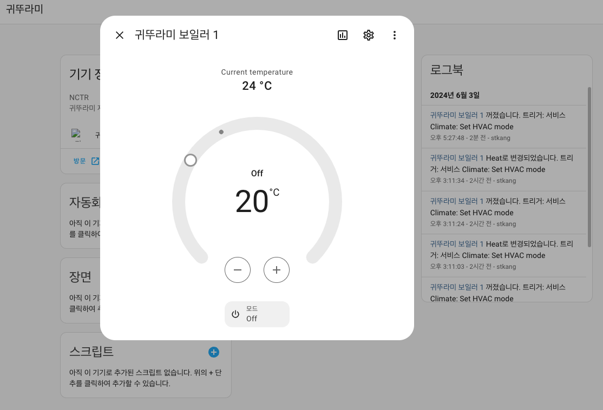
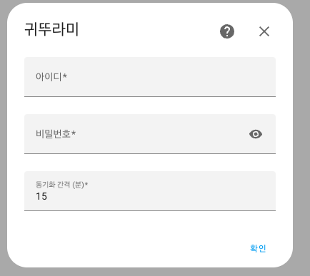

# 귀뚜라미

![HACS][hacs-shield]

문의 : 네이버 [HomeAssistant카페](https://cafe.naver.com/koreassistant)

## 귀뚜라미가 도움이 되셨나요?
TOSS로 기부하기  

## 준비물
- HomeAssistant `최신버전`
- [귀뚜라미 실내온도 조절기](https://krb.co.kr/product9)

## 사용자 구성요소를 HA에 설치하는 방법
### HACS
- HACS > Integrations > 우측상단 메뉴 > `Custom repositories` 선택
- `Add custom repository URL`에 `https://github.com/stkang/ha-component-kiturami` 입력
- Category 는 `Integration` 선택 후 `ADD` 클릭
- HACS > Integrations 에서 `귀뚜라미` 찾아서 설치
- HomeAssistant 재시작

### 수동설치
- `https://github.com/stkang/ha-component-kiturami` 에서 `코드 -> 소스 코드 다운로드(zip)` 을 눌러 파일을 다운로드, 내부의 `kiturami` 폴더 확인
- HomeAssistant 설정폴더 `/config` 내부에 `custom_components` 폴더를 생성(이미 있으면 다음 단계) 설정폴더는 `configuration.yaml` 파일이 있는 폴더를 의미합니다.
- `/config/custom_components`에 위에서 다운받은 `kiturami` 폴더를 넣기
- HomeAssistant 재시작

## 귀뚜라미을 설치하기 전 선행과정
### 귀뚜라미 앱 회원가입
- 구글 플레이 스토어 or 애플 앱스토어에서 `귀뚜라미 보일러`검색 후 `Kiturami IoT 매니저` 설치 
- 회원가입 & 로그인
- 보일러 등록

## 귀뚜라미을 통합구성요소로 설치하는 방법
### 통합구성요소
- HomeAssistant 사이드패널 > 설정 > 기기 및 서비스 > 통합 구성요소 추가
- 검색창에서 `귀뚜라미` 입력 후 선택
- 아이디 비밀번호 입력

[hacs-shield]: https://img.shields.io/badge/HACS-Custom-red.svg